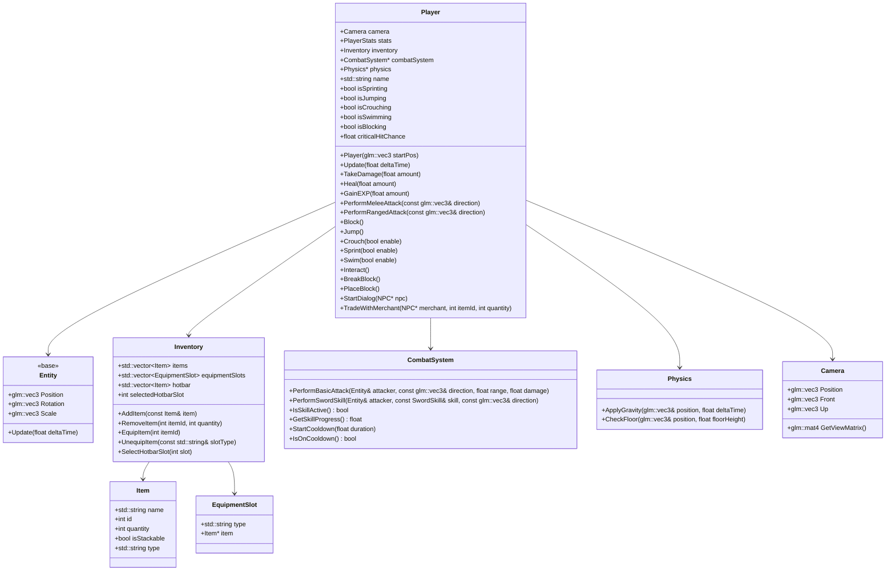

# Player Class Enhancement Plan

## Overview
This plan outlines the enhancements required for the `Player` class to support core Minecraft-inspired gameplay mechanics, including inventory management, combat, movement, and interaction systems. The enhancements will integrate seamlessly with existing systems like `CombatSystem`, `Physics`, `Camera`, and `InputHandler`.

---

## 1. Missing Features Analysis
The current `Player` class lacks the following core gameplay mechanics:

### Inventory System
- **Missing**: Item collection, storage, and management.
- **Required**: Support for stackable items, equipment slots, and a hotbar for quick access.

### Combat Mechanics
- **Missing**: Integration with `CombatSystem` for melee/ranged attacks, blocking, and skill management.
- **Required**: Melee and ranged attacks, blocking, skill cooldowns, and critical hits.

### Movement and Physics
- **Missing**: Advanced movement mechanics like crouching, swimming, and collision detection.
- **Required**: Sprinting, crouching, jumping, swimming, and block collision.

### Interaction System
- **Missing**: Ability to interact with NPCs, monsters, and the game world.
- **Required**: Breaking/placing blocks, NPC dialog, and merchant trading.

---

## 2. Enhanced Player Class Design

### Class Structure
The enhanced `Player` class will include the following components:

#### Inventory System
```cpp
class Inventory {
public:
    struct Item {
        std::string name;
        int id;
        int quantity;
        bool isStackable;
        std::string type; // e.g., "weapon", "armor", "consumable", "block"
    };

    struct EquipmentSlot {
        std::string type; // e.g., "helmet", "chestplate", "weapon"
        Item* item;
    };

    std::vector<Item> items;
    std::vector<EquipmentSlot> equipmentSlots;
    std::vector<Item> hotbar;
    int selectedHotbarSlot;

    void AddItem(const Item& item);
    void RemoveItem(int itemId, int quantity = 1);
    void EquipItem(int itemId);
    void UnequipItem(const std::string& slotType);
    void SelectHotbarSlot(int slot);
};
```

#### Combat Mechanics
```cpp
class Player : public Entity {
public:
    CombatSystem* combatSystem;
    bool isBlocking;
    float blockCooldown;
    float criticalHitChance;

    void PerformMeleeAttack(const glm::vec3& direction);
    void PerformRangedAttack(const glm::vec3& direction);
    void Block();
    void UpdateCombat(float deltaTime);
};
```

#### Movement and Physics
```cpp
class Player : public Entity {
public:
    Physics* physics;
    bool isSprinting;
    bool isCrouching;
    bool isSwimming;
    float swimSpeed;
    float crouchSpeed;
    float sprintSpeed;

    void HandleMovement(float deltaTime, const glm::vec3& inputDirection);
    void Jump();
    void Crouch(bool enable);
    void Sprint(bool enable);
    void Swim(bool enable);
    void UpdatePhysics(float deltaTime);
};
```

#### Interaction System
```cpp
class Player : public Entity {
public:
    void Interact();
    void BreakBlock();
    void PlaceBlock();
    void StartDialog(NPC* npc);
    void TradeWithMerchant(NPC* merchant, int itemId, int quantity);
};
```

---

## 3. Integration with Existing Systems

### CombatSystem
- The `Player` class will use `CombatSystem` for performing attacks, managing cooldowns, and handling critical hits.
- **Dependencies**: `CombatSystem.h`, `SwordSkill.h`, `Hitbox.h`.
- In the current codebase, `Game` owns the authoritative `CombatSystem`; `Player` stores a pointer assigned in `Game::Initialize` to prevent duplicate combat timers/hitbox state.

### Physics
- The `Player` class will use `Physics` for gravity, collision detection, and movement mechanics.
- **Dependencies**: `Physics.h`.
- In the current codebase, `Game` owns a single `Physics` instance; `Player` only keeps a pointer assigned in `Game::Initialize` to avoid duplicating simulation state.

### Camera
- The `Player` class will sync its position and rotation with the `Camera` for first-person perspective.
- **Dependencies**: `Camera.h`.

### InputHandler
- The `Player` class will process input events (e.g., movement, attacks, interactions) via `InputHandler`.
- **Dependencies**: `InputHandler.h`.

### WorldRenderer
- The `Player` class will interact with the game world (e.g., breaking/placing blocks) using `WorldRenderer`.
- **Dependencies**: `WorldRenderer.h`, `ChunkManager.h`.

---

## 4. Mermaid Diagram: Enhanced Player Class Architecture


---

## 5. Actionable Implementation Steps
The following steps will be executed in `💻 Code` mode to implement the enhancements:

### Step 1: Update `Player.h`
1. Add forward declarations for `CombatSystem`, `Physics`, `NPC`, and `Inventory`.
2. Define the `Inventory`, `Item`, and `EquipmentSlot` structs.
3. Add member variables for inventory, combat, movement, and interaction systems.
4. Declare new methods for combat, movement, and interaction.

### Step 2: Update `Player.cpp`
1. Implement the `Inventory` methods (`AddItem`, `RemoveItem`, `EquipItem`, etc.).
2. Implement combat methods (`PerformMeleeAttack`, `PerformRangedAttack`, `Block`).
3. Implement movement methods (`Jump`, `Crouch`, `Sprint`, `Swim`).
4. Implement interaction methods (`Interact`, `BreakBlock`, `PlaceBlock`, `StartDialog`).
5. Update the `Update` method to handle physics, combat cooldowns, and movement.

### Step 3: Integrate with Existing Systems
1. Initialize `CombatSystem` and `Physics` in the `Player` constructor.
2. Sync player position with `Camera` in the `Update` method.
3. Process input events from `InputHandler` for movement, attacks, and interactions.
4. Use `WorldRenderer` for breaking/placing blocks.

### Step 4: Test and Validate
1. Test inventory management (adding/removing items, equipping gear).
2. Test combat mechanics (melee/ranged attacks, blocking, critical hits).
3. Test movement and physics (sprinting, crouching, jumping, swimming).
4. Test interactions (breaking/placing blocks, NPC dialog, merchant trading).

---

## 6. Dependencies
| System               | Header File                     | Purpose                                      |
|----------------------|---------------------------------|----------------------------------------------|
| CombatSystem         | `combat/CombatSystem.h`         | Combat mechanics (attacks, cooldowns)        |
| Physics              | `core/Physics.h`                | Movement and collision detection             |
| Camera               | `core/Camera.h`                 | First-person perspective and view management |
| InputHandler         | `core/InputHandler.h`           | Input processing for movement and actions    |
| WorldRenderer        | `world/WorldRenderer.h`         | Rendering and world interaction              |
| ChunkManager         | `world/ChunkManager.h`          | Block management (breaking/placing)          |
| NPC                  | `entities/NPC.h`                | NPC dialog and merchant trading              |

---

## 7. Compatibility Notes
- The enhanced `Player` class will maintain backward compatibility with existing systems.
- All new features will be implemented in a modular fashion to avoid breaking changes.
- The `Player` class will continue to inherit from `Entity` and override the `Update` method for game loop integration.